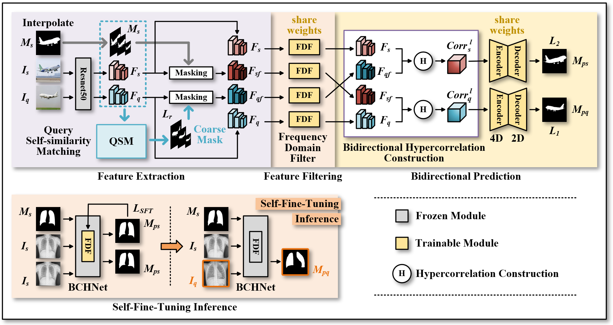

# Bidirectional consistent hypercorrelation network for cross-domain few-shot segmentation

This is the official implementation code of our paper "*Bidirectional consistent hypercorrelation network for cross-domain few-shot segmentation*", published in **Knowledge-Based Systems**, 2025.

## Introduction

The goal of the Cross-Domain Few-shot Semantic Segmentation (CD-FSS) task is to train a generalizable model on the source domain dataset for the segmentation of multiple target domain datasets. We propose a Bidirectional Consistent Hypercorrelation Network (BCHNet) framework to implement CD-FSS. 

<p align="middle">
    
</p>

## Datasets preparation

The following datasets are used for evaluation in CD-FSS:

### Download

#### Source domain (train & val dataset) :

* **PASCAL VOC2012**:

    Download PASCAL VOC2012 devkit :
    ```bash
    wget http://host.robots.ox.ac.uk/pascal/VOC/voc2012/VOCtrainval_11-May-2012.tar
    ```
    Download PASCAL VOC2012 SDS extended mask annotations from [[Google Drive](https://drive.google.com/file/d/10zxG2VExoEZUeyQl_uXga2OWHjGeZaf2/view?usp=sharing)].


#### Target domains (test datasets) : 

* **Deepglobe**:

    Home:  https://www.kaggle.com/datasets/balraj98/deepglobe-land-cover-classification-dataset

    Direct: https://pan.baidu.com/s/1p7qcmjCaMvQSuTHKjqunuA (password: zchh)

* **ISIC2018**:

    Home: http://challenge2018.isic-archive.com

    Direct (must login): https://challenge.isic-archive.com/data#2018

* **Chest X-ray**:

    Home: https://www.ncbi.nlm.nih.gov/pmc/articles/PMC4256233/

    Direct: https://www.kaggle.com/datasets/nikhilpandey360/chest-xray-masks-and-labels

* **FSS-1000**:

    Home: https://github.com/HKUSTCV/FSS-1000

    Direct: https://drive.google.com/file/d/16TgqOeI_0P41Eh3jWQlxlRXG9KIqtMgI/view

* **Verse2D**:

    Direct : https://pan.baidu.com/s/1ycLbvbdZ4Czw224qRiVN1Q (password: zchh)


### File organization: datasets and project files are under parallel paths.
```
BCHNet/                                         # codes
├── common/                                     # log & vis codes
├── data/                                       # Dataloader
├── model/                                      # BCHNet's framework and main modules
├── README.md                                   
├── finetuning.py                                                             
└── train.py     


datasets/                                       # datasets
├── VOC2012/                                    # source dataset: pascal voc 2012
|   ├── JPEGImages/
|   └── SegmentationClassAug/
├── Deeoglobe                                   # target dataset: deepglobe
|   ├── 1/
|   ├── 2/
|   ├── 3/
|   ├── 4/
|   ├── 5/
|   └── 6/
├── ISIC/                                       # target dataset: isic
|   ├── ISIC2018_Task1-2_Training_Input/
|   └── ISIC2018_Task1_Training_GroundTruth/
├── LungSegmentation/                           # target dataset: chest x-ray
|   ├── CXR_png/
|   └── masks/
├── FSS-1000                                    # target dataset: fss-1000
|   ├── ab_wheel/
|   └── ...
└── Verse2D                                     # target dataset: spine verse2D
    ├── 1/
    └── 2/                               
```

## Environment

- python 3.8
- pytorch 1.12 
- torchaudio 0.12 
- torchvision 0.13
- cuda 11.3
- tensorboard 2.2

## Training
> ### PASCAL VOC
> ```bash
> python train.py
> --benchmark pascal
> --lr 1e-3
> --bsz 12
> ```
> We trained BCHNet with a single NVIDIA RTX A5000 (24GB) GPU. It took approximately 10 hours to complete the training process.

You can also download our trained model (if you just want to test):
* our trained BCHNet model : BCHNet_best.pth https://pan.baidu.com/share/init?surl=647L5uRBlp2TbKwiSKBP5A (password: zchh)


## Testing with SFT
> ### 1. Deepglobe ( lr = 1e-7 )
> ```bash
> python finetuning.py 
> ```

> ### 2. FSS-1000 ( lr = 1e-2 )
> ```bash
> python finetuning.py 
> ```

> ### 3. ISIC ( lr = 1e-1 )
> ```bash
> python finetuning.py 
> ```

> ### 4. Chest X-ray ( lr = 1e-1 )
> ```bash
> python finetuning.py 
> ```

> ### 5. Verse2D_axial ( lr = 1e-1 )
> ```bash
> python finetuning.py 
> ```


## Domain-specific models 
If you are interested in domain-specific models, you can download our domain-specific item.
* direct: https://pan.baidu.com/s/1GDDUTb4hg1E3xINF4XIBaw (password: zchh)

## Citation
If you use this code for your research, please consider citing:
```bash
@inproceedings{KBS2025Tang,
  title   = {Bidirectional consistent hypercorrelation network for cross-domain few-shot segmentation},
  author  = {Tang Chenghua, Yi Jianbing, and et al.},
  journal = {Knowledge-Based Systems, {KBS 2025}},
  year    = {2025}
}
 ```

## Acknowledgement
The implementation is based on [HSNet](https://github.com/juhongm999/hsnet) and [DMTNet](https://github.com/ChenJiayi68/DMTNet). <br>
We appreciate the work of HSNet [1], PATNet [2], DMTNet [3] and other FSS & CD-FSS works for their great contributions.


## References

[1] J. Min, D. Kang, and M. Cho, Hypercorrelation Squeeze for Few-Shot Segmentation. IEEE International Conference on Computer Vision (ICCV), 2021.

[2] S. Lei, X. Zhang, J. He, F. Chen, B. Du, and C. Lu, Cross-Domain Few-Shot Semantic Segmentation. European Conference on Computer Vision (ECCV), 2022.

[3] J. Chen, R. Quan, and J. Qin, Cross-Domain Few-Shot Semantic Segmentation via Doubly Matching Transformation. International Joint Conference on Artificial Intelligence (IJCAI), 2024.
